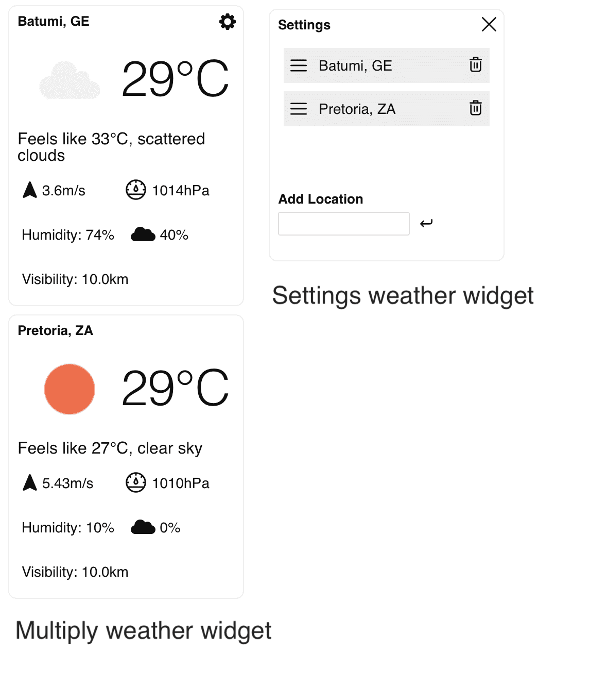

# Documentation for Weather Widget


### This is a weather widget where you can select multiple cities. Suitable for insertion via tag - see below
## Installation and launch

You can use Yarn to manage dependencies and run your Vue.js application. Here are the main commands:

Installation

```bash
yarn install
```

Assembly

```bash
yarn build
```
Starting the development server

``` bash
yarn serve
```

## Working with the API

### Ninja API
API for getting information about a city by its name. Check out the documentation [here.](https://api-ninjas.com/api/city)

### Open Weather API
API for getting the current weather. Check out the documentation [here.](https://openweathermap.org/current)
## Navigation /src/
### assets/
```reset.css```:Style reset file to normalize browser styles.
```variables.scss```: Variables file to use in your style.
### components/
```Icons```: Icon components that provide a set of icons for your application.

```WeatherCard/WeatherCard```: A weather card that displays weather information for a specific city.

```WeatherCard/WeatherCardSkeleton```: Skeleton weather card used during data loading.

```WeatherSettings```: The weather settings component, including:

```AddLocation```: Add a new city.

```DraggableCities```: Component for changing the sequence of cities.
```VInput```: Generic component for inputs, configurable.

```VLoader```: A loader component for displaying loading.

### store/

```common.ts```: Common state for managing common data and state.

```weather.ts```: State for handling business logic and asynchronous requests in the widget.
### types/
```index.ts```: Defined common data types for use in components and business logic.

```App.vue``` is the main component of your widget. It brings all the components together and defines the overall structure of the widget.

### Point of entry

```main.ts``` is the entry point to your application. This is where the creation and configuration of the Vue instance takes place.

## To embed on your site
### Copy these script tags:
```html
 <script
        defer
        src="https://weather-widget-pi.vercel.app/js/embed.js"
></script>
```
### And insert the html tag:
```html
  <div id="app">
    <weather-widget></weather-widget>
</div>
```
### Simple usage example:
```html
<html lang="">
<head>
    <meta charset="utf-8" />
    <meta http-equiv="X-UA-Compatible" content="IE=edge" />
    <meta name="viewport" content="width=device-width,initial-scale=1" />
    <title>Vue App Widget Test</title>
    <script
            defer
            src="https://weather-widget-pi.vercel.app/js/embed.js"
    ></script>
</head>
<body>
<div id="app">
    <weather-widget></weather-widget>
</div>
</body>
</html>


```
